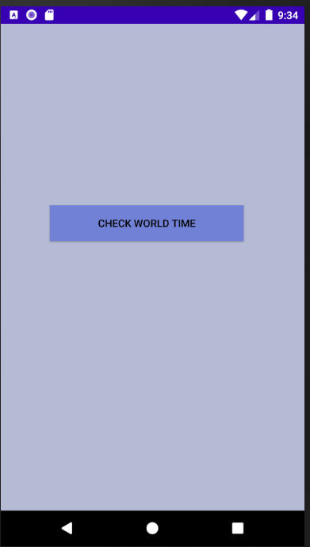
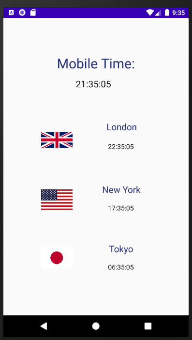

# ClockApp_AndroidStudio
> App that gets information about time in different timezones and displays it.

## Technologies
* Java
* Android Studio

## Screenshots

* Tap the button to check the time.

